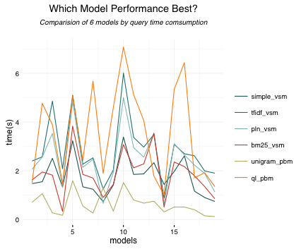

#Furnito

##Contents

+ [Intro](#intro)
+ [Business](#business)
+ [Inrerface](#interface)
+ [Crawler](#crawler)
+ [Tokenize and Preprocessing](#tokenize)
+ [Indexing](#indexing)
+ [Ranking](#ranking)
+ [Human-Computation](#human-computation)
+ [Evaluation](#evaluation)
+ [Furture](#future)

<h2 id='intro'>Intro</h2>

*Furnito* is a web application that acts as an online interior decorator. It help users decorate their homes by letting them match their type of furniture which they already have with new types of furniture. This project idea description document will elaborate on the technical aspects of the system, like a module description and a system evaluation (metrics) description. Furthermore, it will elaborate on the social aspects of the system, like a stakeholder description and a business case description. 

<h2 id='business'>Business</h2>
Business process model 

Business model canvas

<h2 id='interface'>Interface</h2>

<h2 id='crawler'>Crawler</h2>

The goal of our web crawler is to access data *quickly*, *efficiently* and as many *useful resources* as possible. As our target site is [overstock](http://www.overstock.com/) — a furniture website, we need to crawl as many furnitures as possible, so the design of crawler is respect to *breath first strategy*. Here is a short description of different modules of our crawler:

1. config module, record all user configurable settings, including `base_url`, `depth`, `data_path` etc.
2. initial module, initial a  classes and libraries we need to use. As we are using python for the whole project, the initial module is written in `__init__.py`.
3. field module, decide for a specific furniture, which field of data do we nedd to crawl. For our case, furniture `name`, `price`, `description`, `reviews` and `origin_link` are the most important properties.
4. crawl module, using *Xpath* extractor to extract useful field for a given furniture url.
5. url manager, manage url, include several functions including `add_url`, `remove_url` and `history_url`. This module is used for interact with module *URL_POOL*.
6. url pool, manage url in a queue data structure, and ensure there is no duplicate url exist.
7. robot module, use to read *Robot.txt* and decide crawl strategy.
8. log module, use to recode error in order to keep crawler robust.

Use `config.py` to config your personal settings, run `start.py` to start crawl. Library dependency: `lxml` and `requests`.

<h2 id='tokenize'>Tokenize and Preprocessing</h2>

It helps in preprocessing of the string by tokenization, stemming. It helps in making the text precise and meaningful so that it can be easily used for indexing. Tokenization helps in the breaking of a string into tokens and stemming helps in the reduction of the words into their root words so that indexing becomes easier.

<h2 id='indexing'>Indexing</h2>

The general introduction of how to build an *Inverted Index* can be found [here](http://nlp.stanford.edu/IR-book/information-retrieval-book.html). In **Furnito**, we implemented an simple *inverted index* which contains two parts: first part is *dict* and the second part is a *posting list*. Below I'd like to introduce these two parts separately.

**Dictionary** is a part allow query to quickly access where is the current document storage, this part need to be store in memory. For most cases, **Dictionary** need to be store in *hashtable*, in python, we use *dict*. The data structure of our Dictionary looks like this:

| index | term   |
| ----- | ------ |
| 0     | aero   |
| 1     | bed    |
| ...   | ...    |
| n     | yellow |

As shown in table, we gave each term an *index*, and different terms a sorted alphabetically. In order to avoid memory overload, we done this task by the following steps:

1. collect `term`,  `doc_name` from 1 furniture document, write to temp file.
2. collect the same fileds from the second document and pair-wise merge two list of terms.
3. loop through all other furniture documents and do the same thing.
4. use `defaultdict` of python to reduce data according to term, get result like this: `{term: [doc1, doc3, doc7]}`, where term is the sorted term, list of doc indicates in which documents the current term appears.
5. Construct **Dictionary** by adding a int index, store in memory.
6. Construct **Pooling List** by replace all terms by index defined before, export to local storage.

Finally Inverted Index looks like this:

<h2 id='ranking'>Ranking</h2>

<h3 id='vsm'>Vector Space Model</h3>

As user send a query, system map query into term id from *dictionary* and then find doc location from posting list. Since we have user query and doc location, it si feasible for us to use a model to give each document a score and make a ranking. The first model we used is *Vector Space Model*.  According to different level of complexity, we implemented 4 vector space models, including *Simple Vector Space Model*, *TF-IDF Vector Space Model*, *Pivot Length Normalized Vector Space Model* and *BM25/Okapi Vector Space Model*. In the following paragraphs, we'll describe why and how we build different models.

`simple_vector_space_model`: We call it 'simple' because it's just finished a dot-product between user query and doc location. Since we want to increase the weight of *valuable* terms and reduce the weight of *normal* terms, this model need to be improved. 

`tfidf_vector_space_model`: According to different terms and documents, we built a *vector space*. It contains *document frequency*, *term-frequency* for each term and each document. Generally, it's like a data frame and we stored it into a cvs file. Except just multiply user query vector and document vector, we added the term frequency into the data frame, and compute `idf` score according to the document frequency. Then gave the result score. If we consider different documents may have different length, and it is unfair to rank long documents and short documents, model still need to be improved.

`pln_vector_space_model`: inspired by Sing et al [1], we implemented one of the state-of-art model named *pivot length normalization vector space model*. In this model, query vector and idf part was fixed, add another variable `b` (between 0 and 1) to control the length of each document. The performance of pln model will be evaluated in the latter section.

`bm25_vector_space`:  Model *bm 25* was one we learned from another paper from Robertson & Walker[2].  This model add a *TF-Transform* term `k` (from 0 to infinity) and `b` (between 0 and 1) to provide precise ranking result. Also, the performance of bm25 will be evaluated in the later section.

<h3 id='pbm'>Probabilistic Model</h3>

We also tryied to rank documents by asesss the most likely relevant document according to user query.  Based on probabilistic basis, we implemented 2 models:

`unigram_probability_model`, this is the most simple probabilistic model that use language model to model user query text. Statisticsl language model is a probability distribution over word sequence. 

`query_likely_model`, we use the whole furniture data as a reference language model, and by using *linear-interpolation-smoothing*, get our second model. This model use smoothing method based on reference set to give each unseen term an estimate probability. We'll evaluate the model in the later evaluation section.

<h3 id='l2r'>Learning to Rank</h3>

<h2 id='human-computation'>Human-Computation</h2>

### Human computational model

For the human computation, Crowdflower is used. The workforce is asked to match furniture together, according to their taste. Because of the large amount of the data in the final product (we now already have 1000 pieces of furniture), the necessary amount of questions could be millions. To reduce the amount of questions necessary some measures have been taken. First of all, it is assumed that people only want to match furniture within a certain room. So, only furniture within a bathroom, or only furniture within in living room. Secondly, it is assumed that people do not want to match the same type of furniture with each other. So, people do not want to match a chair with a chair. Thirdly, the matching on crowdflower is done pairwise instead of groupwise. In other words, not one chair with one sofa, but one chair with 20 other furniture. 

### Relevance

How does a certain piece of furniture become relevant to another piece of furniture? One person might say they think a chair fits together wit a table, while another person might dislike this match. This is why probabilistic models should be used in the final project. For now, we assume that if 10 people say they think two items fit together, it becomes a significant match. The, the more votes a certain combination gets, the more relevant it becomes. 

To make the matching a more personal experience, workers are asked to submit their age and gender. The user of Furnito can than submit his age and gender, and than get relevant furniture based on these data. This is done because it is assumed that women and men of different ages have a different taste. Due to the scope of this project, this is something that can be implemented in the future. 

### The question

So, how does a question look like on crowdflower? The worker is asked to submit their age and gender, after that the questioning starts. A question consists of the following question:
“Which 5 furniture doe you think fits together in one room? Choose your 5 most favorite furniture.” The worker than chooses his most favorite furniture and moves on to the next question. 

<h2 id='evaluation'>Evaluation</h2>

IR provided us various retrieval metrics and by applying different retrieval techniques to Furnito, we are able to denote which model has the best performance. Our evaluation strategy includes:

1. Enough relevant documents.
2. Capture the perceived utility by users.
3. Completeness and minimum human work.
4. Resuable test set.

By perform a unbias and fair evaluation, we divided the evaluation task into these small tasks.

1. Choose a diverse set of ranking models, for example, `simple vsm`, `tf-idf_vsm`, `pln_vsm`, `simple_pbm`, `query_likely_pbm`, `bm25`.
2. Have each model return top-20 documents based on each query.
3. Combine all top-20 sets to form a *pool*.
4. Record relevant result including Precision, Recall,  Precision at 10, excusion time.
5. Process another query.
6. Compute MAP score.

###Excursion Time

| term                          | simple | tfidf | pln  | bm25 | unigram | querylikely |
| ----------------------------- | ------ | ----- | ---- | ---- | ------- | ----------- |
| chair                         | 1.47   | 2.40  | 2.06 | 1.62 | 0.7     | 1.51        |
| bookcase vertical storage     | 1.55   | 2.57  | 2.56 | 1.95 | 1.06    | 4.77        |
| chair dining wood             | 2.51   | 4.86  | 3.53 | 1.82 | 0.27    | 3.89        |
| bookcase quality              | 1.12   | 0.97  | 0.36 | 0.30 | 0.23    | 1.48        |
| table coffee                  | 1.33   | 2.08  | 1.34 | 0.33 | 0.17    | 1.46        |
| table wood black              | 3.23   | 5.10  | 4.84 | 3.83 | 1.59    | 5.09        |
| sofa leather                  | 1.34   | 2.27  | 2.14 | 1.85 | 0.55    | 2.43        |
| sofa firm black               | 1.24   | 2.53  | 2.47 | 1.70 | 0.26    | 5.68        |
| cabinet glass                 | 0.73   | 1.25  | 0.66 | 0.90 | 1.30    | 1.89        |
| cabinet classic dishes        | 1.41   | 2.03  | 1.93 | 1.44 | 0.34    | 4.59        |
| chair high black good looking | 3.38   | 6.01  | 5.00 | 3.07 | 1.51    | 7.08        |
| chair fantastic comfortable   | 1.85   | 3.37  | 2.95 | 2.12 | 0.80    | 5.13        |
| bookcase open shelves         | 1.87   | 2.97  | 2.56 | 2.28 | 0.67    | 4.06        |
| bookcase modern               | 2.33   | 3.49  | 3.53 | 3.54 | 0.75    | 1.78        |
| table gorgeous                | 1.44   | 0.88  | 0.63 | 0.51 | 0.31    | 1.00        |
| table black tea               | 1.97   | 3.08  | 3.11 | 2.36 | 0.51    | 5.34        |
| sofa business black           | 2.61   | 2.70  | 2.65 | 2.17 | 0.51    | 6.44        |
| sofa comfortable              | 1.16   | 2.61  | 2.23 | 1.79 | 0.40    | 1.71        |
| cabinet kitchen               | 0.90   | 1.99  | 1.89 | 1.35 | 0.15    | 1.92        |
| cabinet dinerware             | 0.74   | 1.90  | 1.13 | 0.85 | 0.12    | 1.35        |

*seconds*

Visualize

<h2 id='future'>Future</h2>

<h2 id='reference'>Reference</h2>